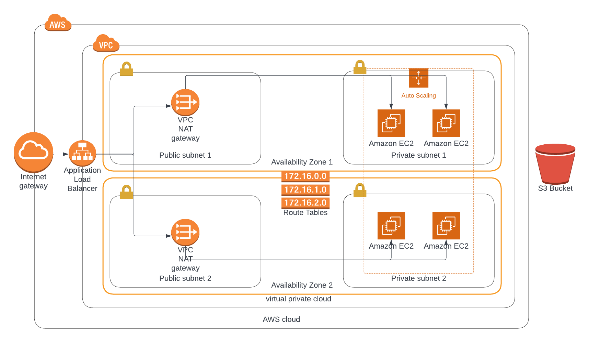

# Udagram-High-Availability-Cloud-WebApp

Deploying Udagram, a dummy webapp, by provisioning its resources through AWS CloudFormation templates. Instances configured to run Apache web servers on launch and accessing relavent website files from an S3 bucket.

This is part of Udacity's Cloud DevOps Nanodegree in partnership with EGFWD.

## Project Requirements

### Servers: 
1) A Launch Configuration deploying four servers, two located in each of your private subnets. The launch configuration will be used by an auto-scaling group.
2) Two vCPUs and at least 4GB of RAM. The Operating System to be used is Ubuntu 18.
3) Allocate at least 10GB of disk space.

### Security Groups and Roles: 
1) IAM Role that allows your instances to use the S3 Service.
2) Udagram communicates on the default HTTP Port: 80, so your servers will need this inbound port open since you will use it with the Load Balancer and the Load Balancer Health Check. As for outbound, the servers will need unrestricted internet access to be able to download and update their software.
3) The load balancer should allow all public traffic (0.0.0.0/0) on port 80 inbound, which is the default HTTP port. Outbound, it will only be using port 80 to reach the internal servers.
4) The application needs to be deployed into private subnets with a Load Balancer located in a public subnet.
5) Export the public http:// URL as a stack output.

## Diagram:


### Running the scripts:
- Create the networking infrastructure's stack first using:
```
./create.sh infraStack infra.yml infraparams.json
```

- After the successful completion of infraStack, create the servers' stack using:
```
./create.sh serversStack servers.yml serverparams.json
```
